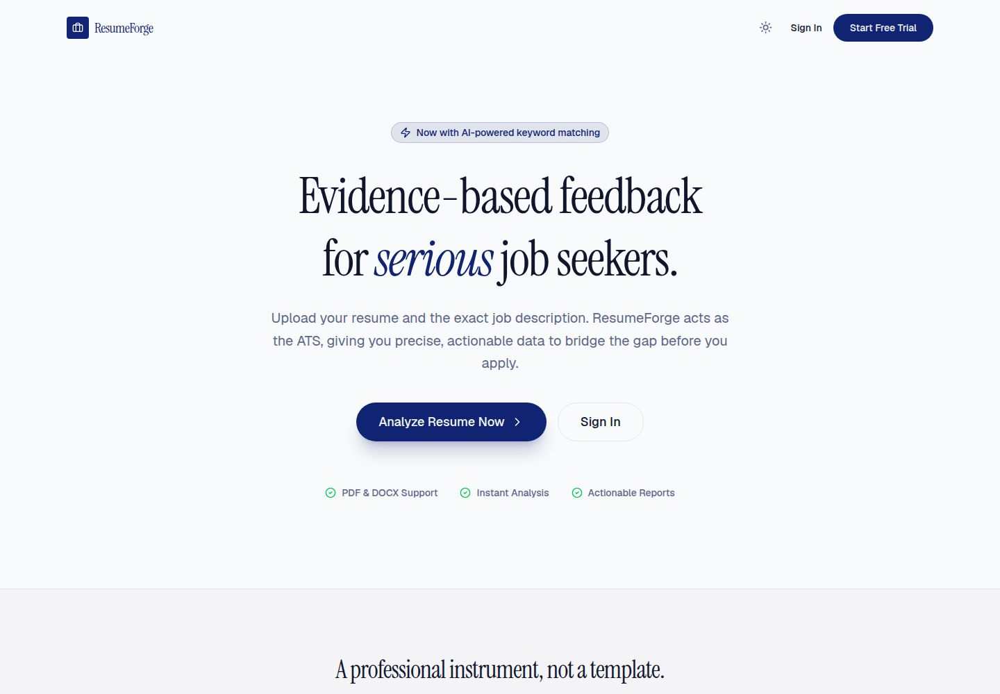

# ResumeForge

ResumeForge is an evidence-based ATS resume builder and checker for job seekers. Build an ATS-friendly resume, compare an existing PDF or DOCX against a job description, understand the score, and improve the content without inventing qualifications.

## Product preview

  

  

## What it does

- Build and preview structured ATS-friendly resumes.
- Upload PDF or DOCX resumes for text extraction and analysis.
- Compare a resume with a job description.
- Calculate explainable ATS scores and category breakdowns.
- Identify missing keywords, skills, sections, formatting issues, and keyword-density problems.
- Review action-verb recommendations and prioritized improvement suggestions.
- Generate optional OpenAI-assisted summaries and bullet rewrites.
- Save analyses and resumes to a private, authenticated dashboard.
- Search analysis history and download a self-contained analysis report.
- Use the interface in light or dark mode across desktop and mobile.

## AI safety

AI output is presented as drafting guidance and must be reviewed before it is used in a resume. Resume claims are grounded deterministically:

- Rewrite requests must contain an exact source bullet from the uploaded resume.
- Numeric claims and vocabulary are checked against the source resume.
- Unsafe summaries and rewrites use safe source-derived fallbacks.
- Job-description keywords can guide recommendations but cannot become unsupported resume facts.

## Architecture

This repository is a pnpm workspace monorepo built around the existing the development environment artifact structure:

- artifacts/ats-resume — React and Vite web application.
- artifacts/api-server — Express API for authentication, uploads, ATS analysis, persistence, and AI suggestions.
- lib/api-spec — OpenAPI source of truth.
- lib/api-client-react — generated React Query client and hooks.
- lib/api-zod — generated request and response schemas.
- lib/db — PostgreSQL schema and Drizzle ORM access.
- lib/integrations-openai-ai-server — OpenAI-compatible server integration OpenAI client.

## Technology

- React 19, Vite, TypeScript, and Tailwind-based UI components.
- Express 5 with Clerk authentication middleware and structured logging.
- PostgreSQL with Drizzle ORM.
- Zod and generated OpenAPI/Orval contracts.
- OpenAI-compatible server integration for OpenAI access without exposing provider credentials to the client.
- pnpm workspaces and esbuild.

## Getting started

Require Node.js and pnpm. Install dependencies from the repository root:

    pnpm install

Configure the environment using .env.example. Database, Clerk, and the development environment AI Integration values should be provided through your environment or the development environment Secrets; never commit secret values.

Run the services with the configured workspace workflows, or start them individually:

    pnpm --filter @workspace/api-server run dev
    pnpm --filter @workspace/ats-resume run dev

The artifact workflows provide the ports and proxy routing used by the local development preview.

## Development commands

    pnpm run typecheck
    pnpm run build
    pnpm --filter @workspace/api-spec run codegen
    pnpm --filter @workspace/db run push

Run database schema pushes only against a development database. After changing lib/api-spec/openapi.yaml, regenerate the typed API client and Zod schemas before testing dependent routes.

## Security and data handling

- Clerk user IDs scope resumes and analyses to their owner.
- Only PDF and DOCX uploads are accepted.
- Uploads are size-limited and validated using file signatures and DOCX structure checks.
- Extracted text and job descriptions have explicit size limits.
- Scanned image-only PDFs are rejected when no text can be extracted.
- Secrets belong in the development environment Secrets or environment configuration, not in source control.

## Main API capabilities

- Create an analysis from a multipart resume upload and job description.
- Retrieve, search, and delete authenticated analysis history.
- Generate persisted AI suggestions for an analysis.
- Rewrite an exact source bullet with grounding validation.
- Download a self-contained HTML analysis report.

## License

This project is maintained as a private application repository.
